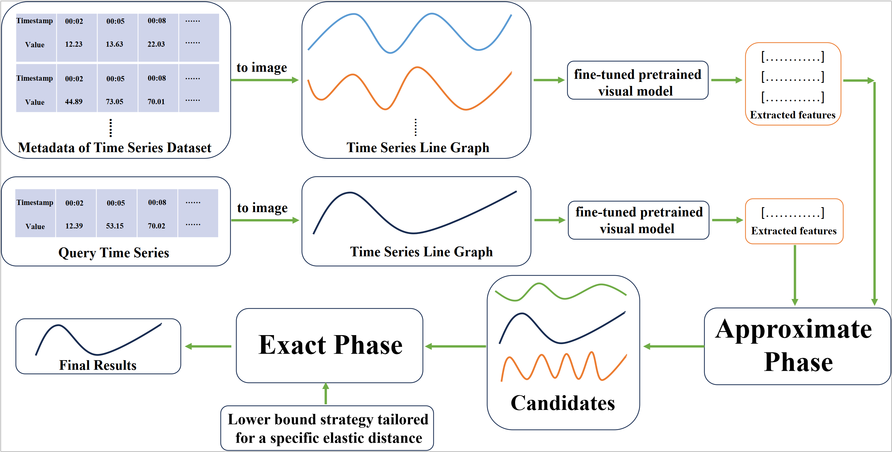

# EViTS: Can Vision-Based Pretrained Models Help with Time Series Similarity Search under Elastic Distances?
This repository is the official implementation of [Can Vision-Based Pretrained Models Help with Time Series Similarity Search under Elastic Distances?], 
submitted to AAAI 2026  (Under Review)

## The overall execution process of applying the EViTS algorithm to time series similarity search.

 

## Usage

Our code is easy to run; Run to_image.py to convert time series into images, fine_tune_model.py to fine-tune the pretrained vision model, and image_to_features_using_tune.py to extract features. Query accuracy can be evaluated by executing main_accuracy.py, while query efficiency can be measured by running main_efficiency.py.

## The UCR time series.

We directly read the UCR dataset through the interface of the aeon library.

UCR dataset(https://www.cs.ucr.edu/~eamonn/time_series_data_2018/)

**Requirements**: NumPy, scipy, matplotlib, aeon, sklearn, numba, pandas, pymetis, random, sktime,timm,pytorch

## Acknowledgments

We express our gratitude to Dr.Eamonn Keogh and his colleagues for providing the UCR datasets [1] used in this article.

Thanks to the authors of aeon[2],sktime[3], and GLB[4] for providing such excellent libraries!

[1] Hoang Anh Dau, Eamonn Keogh, Kaveh Kamgar, Chin-Chia Michael Yeh, Yan Zhu, Shaghayegh Gharghabi , Chotirat Ann Ratanamahatana, Yanping Chen, Bing Hu, Nurjahan Begum, Anthony Bagnall , Abdullah Mueen, Gustavo Batista, & Hexagon-ML (2019). The UCR Time Series Classification Archive. URL https://www.cs.ucr.edu/~eamonn/time_series_data_2018/

[2] Middlehurst M, Ismail-Fawaz A, Guillaume A, et al. aeon: a Python toolkit for learning from time series[J]. Journal of Machine Learning Research, 2024, 25(289): 1-10.

[3] Löning M, Bagnall A, Ganesh S, et al. sktime: A unified interface for machine learning with time series[J]. arXiv preprint arXiv:1909.07872, 2019.

[4] Paparrizos J, Wu K, Elmore A, et al. Accelerating similarity search for elastic measures: A study and new generalization of lower bounding distances[J]. Proceedings of the VLDB Endowment, 2023, 16(8): 2019-2032.
